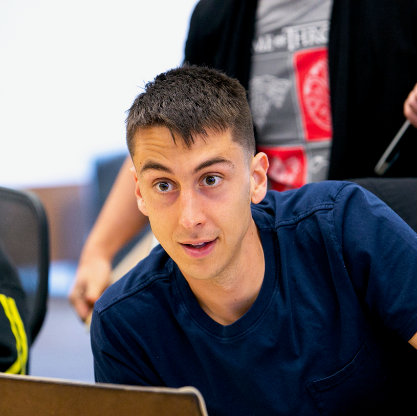

# Matthew Larkins 

*B.S. Computer Engineering Student at UC San Diego*

**Favorite Programming Languages:**

- [C++](https://github.com/KhanKhuu?tab=repositories&q=&type=&language=c%2B%2B) (my public repos that use C++)
- [Swift](https://github.com/KhanKhuu?tab=repositories&q=&type=&language=swift) (my public repos that use Swift)
- [Python](https://github.com/KhanKhuu?tab=repositories&q=&type=&language=python) (my public repos that use Python)

**Top 5 Projects I am Most Proud of:**

1) [FoodSelect](https://github.com/KhanKhuu/matthew-larkins.github.io/blob/add-index-file/index.md#foodselect)
2) [FoodSelect.io](https://github.com/KhanKhuu/matthew-larkins.github.io/blob/add-index-file/index.md#foodselectio)
3) [PiTank](https://github.com/KhanKhuu/matthew-larkins.github.io/blob/add-index-file/index.md#pitank)
4) [EyeSaver](https://github.com/KhanKhuu/matthew-larkins.github.io/blob/add-index-file/index.md#eyesaver)
5) [PMRF-D](https://github.com/KhanKhuu/matthew-larkins.github.io/blob/add-index-file/index.md#pmrf-d)

**Favorite Line of Code:**

`previewView.videoPreviewLayer.videoGravity = .resizeAspectFill`
(causes camera stream to take up entire screen on IOS devices with screen aspect ratios different from their camera aspect ratio)

**Favorite Quote:**
> Take care not to be Caesarified, or dyed in purple: it happens. So keep yourself simple, good, pure, serious, unpretentious, a friend of justice, God-fearing, kind, full of affection, strong for yor proper work. Strive hard to remain the same man that philosophy wished to make you. Revere the gods, look after men. Life is short. The one harvest of existence on earth is a godly habit of mind and social action. 
>
>\- Marcus Aurelius

#### FoodSelect 

An app that helps users avoid toxic additives in food using their phone cameras and ingredients lists or UPC codes on food packages.

#### FoodSelect.io

Landing page for the FoodSelect app

#### PiTank

A raspberry pi-powered rover with an iOS app that wife and I can use to drive around our home and view the video stream

#### EyeSaver

One of the earliest projects using the OpenCV AIKit (OAK) module. Uses the OAK camera to estimate a users gaze and determine whether they are looking at their computer screen or not, sending an alert if they have been looking for too long and need to take a break.

#### PMRF-D

Research project with Dr. Talita Perciano at Lawrence Berkeley National Laboratory. This project adapts the MPI-PMRF framework to the task of denoising large images, e.g. material sample images from beamline 8.3.2 at the Advanced Light Source user facility at Berkeley Lab.

